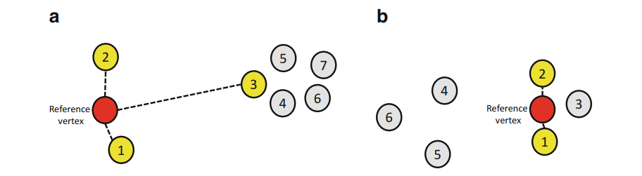
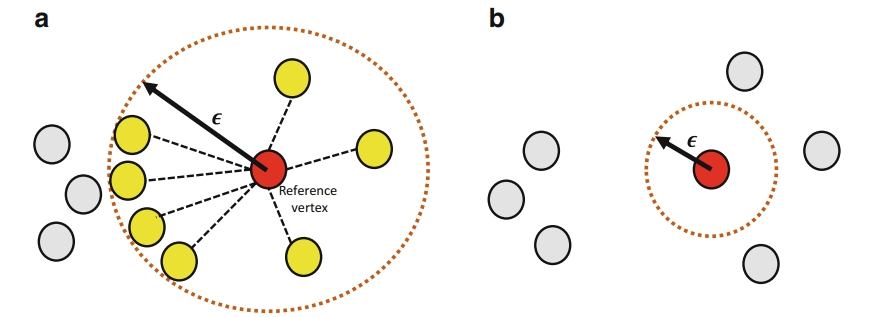
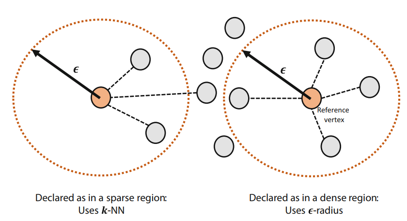
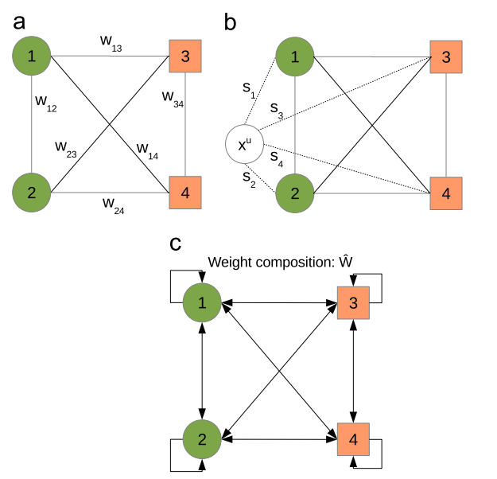

.. sknet documentation master file, created by
   sphinx-quickstart on Fri Mar  5 05:44:33 2021.
   You can adapt this file completely to your liking, but it should at least
   contain the root `toctree` directive.

User Guide
**********

This section will introduce the main modules of the sknet and show some examples as well as explaining the theory
behind the implemented algorithms.

The sknet main structure divide the classes into two main types: auxiliary methods such as utilities and transformations and
machine learning methods which are divided into supervised, unsupervised and semi supervised methods.

Most of the Machine Learning methods can work both with tabular data (in form of a Pandas Dataframe or a Numpy Array) and with graph data
(in form of a NetworkX complex network), exceptions will be explicit on the documentation.

Transformation methods
======================

These are the backbones of the inner workings of the sknet. The transformation classes are responsible for transforming data from one
type to another. To this date, the following transformations are possible:

- Tabular Data -> Complex Network
- Time Series -> Complex Network

The Machine Learning classes are responsible for transforming data to the appropriate format for each one, however, one can always
insert the already transformed data into the class.

Dataset Constructors
--------------------

Those are the methods responsible for transforming tabular data, from the Pandas DataFrame or the Numpy Array format into a
NetworkX complex network.

When dealing with Dataset Constructors, one may have the classes of the tabular data availabe (such as on a supervised method),
on that case, one may set the constructor so it will generate separated components for each class. Some Machine Learning models
will require this while others will require that no separated component is generated. Look up for the documentation of each method
to be aware of the requirements for each method.

KNN Constructor
^^^^^^^^^^^^^^^

The KNN Constructor uses a k-Nearest Neighbors algorithm to create edges between the instances (rows) of our tabular dataset. For that
the distance between each instance of the dataset is calculated using some distance metric, like the Euclidean Distance, and then, for each
instance, the k closest instances are selected and edges are created between them.

Notice that this methodology does not create a symmetric network since, given node ``i``, node ``j`` could be one of the k closest points to it but
the contrary may not be true.

Also, this method does not allow for singletons to be created. If a node is too far away from the others on the generated space, it will
create at least k edges with k other nodes.

The main drawback of this methodology is that, for dense regions where there are too many nodes close to each other, the degree of each node
will be underestimated.

Epsilon-Radius Constructor
^^^^^^^^^^^^^^^^^^^^^^^^^^

The Epsilon-Radius constructor, for each node (row) of the dataset, connects it to all nodes that are inside a circle of radius epsilon.  For that
the distance between each instance of the dataset is calculated using some distance metric, like the Euclidean Distance.

This methodology will create a symmetric network since that, for a node to be inside the radius of another, the contrary must also be true at all times. However
this method allows singletons to be created since it may be that there are no nodes inside the radius, which is a big drawback of this method.

KNN Epsilon-Radius Constructor
^^^^^^^^^^^^^^^^^^^^^^^^^^^^^^

To overcome the drawbacks of both, the KNN Constructor and the Epsilon-Radius constructor, the KNN Epsilon-Radius Constructor tries to sum-up the strenghts
of both methods. This constructor will use the Epsilon-Radius method for dense regions of the space and the K-NN method for sparse regions according to the
following equation:

.. math::

   \left\{\begin{matrix}
      \epsilon\text{-radius}(v_i), & \text{if} |\epsilon\text{-radius}| > k \\ 
      k\text{-NN}(v_i), & \text{otherwise} 
   \end{matrix}\right.

The idea behind this strategy is to add more edges on dense regions that should be more densely connected and to avoid singletons being created on sparse
regions. This way, the generated network will be connected and will have a variable degree level, better representing real world networks.

Single Linkage Clustering Heuristics Constructor
^^^^^^^^^^^^^^^^^^^^^^^^^^^^^^^^^^^^^^^^^^^^^^^^

This constructor uses the idea of the Single Linkage heuristic for clustering to generate a network that preserves the original clustering topology
of the dataset. This tries to avoid the over sparsity or over density of the generated networks from the previous constructors that are not able to
guarantee the maintainance of the cluster topology.

The first step is to calculate the distance between each instance of the dataset is calculated using some distance metric, like the Euclidean Distance.
With that in hands, each node is considered a cluster, then, the two closest clusters are found and the k nearest neighbors between them are connected
by edges if their distance is smaller than a threshold defined by the intra-cluster dissimilarity of each one.

This process merges the two clusters. Then, it repeats until we have only one cluster left, then the network is complete.

This method will keep the sparsity between clusters and the density inside a cluster, which, depending on the problem at hand, can be necessary
for the study of the data.

More information about this method can be found in the following paper:
Cupertino, T.H., Huertas, J., & Zhao, L. (2013). Data clustering using controlled consensus in complex networks. Neurocomputing, 118, 132-140.

Time Series Constructors
------------------------

Those are the methods responsible for transforming time series data, univariate or multivariate, into a complex network representation.

Correlation Constructor
^^^^^^^^^^^^^^^^^^^^^^^

The idea behind the Correlation Constructor is to split the time series into N segments of lenght L
each one which will be a node in our complex network. Then, having those segments, one can calculate the pearson correlation coefficient
between those segments, creating a correlation matrix C.

Then, an user-defined parameter ``r`` defines the correlation threshold for the creation of an edge between two nodes (segments) of the
network. If the correlation between them is greater than ``r``, then an edge is created.

Notice that this generate an undirected graph since the correlation between two segments will always be symmetric. This module implements
two variations of this method: one for univariate time series and another for multivariate times series.

More information about those methods can be found on: Yang, Y., Yang, H.: Complex network-based time series analysis. Physica A 387, 1381–1386 (2008)

Recurrence Constructor
^^^^^^^^^^^^^^^^^^^^^^

The recurrence constructor uses the concept of recurrence on the phase space of the time series. Given an embedding of the time series (such as the
Takens Embedding), it is said that two states are recurrent if they are similar enough. So, given two states in the phase space defined as:

.. math::
    x_i = (x(t), x(t + \tau), \dots , x(t + (d - 1)\tau))

Two states are recurrent if:

.. math::
    ||x_i - x_j|| < \epsilon

Then, after the embedding was made, one can easily calculate a distance matrix between each of the states. Then, the self-loops (diagonals) are
set to zero and every entry smaller than epsilon will generate an edge between the states of the series.

More information about this method can be found on: Donner, R.V., Zou, Y., Donges, J.F., Marwan, N., Kurths, J.: Recurrence
networks – a novel paradigm for nonlinear time series analysis. New J. Phys. 12, 033025 (2010)

Supervised Methods
==================

Supervised methods have one objective: given a labeled dataset, learn the data patterns to the able to predict the label (continous or discrete)
of new, unseen, data samples.

Heuristic of Ease of Access
---------------------------

This algorithm can be used, both, as a classifier and as a regressor. Its main idea is to consider the network as a Markov Chain to, on the convergence
of the chain, identify which classes (or values) have a higher probability for a given unlabeled instance.

Given the network with labeled instances we have the weight matrix of the network, which can be considered as the adjacency matrix of a weighted network.

For each unlabeled instance we add it to the network and calculate the similarity (which in this case can be an Euclidean distance for example) of this
new node to every other node of the network which will be put into a vector ``S``. Using those similarities, we will disturb the weights matrix, using
an parameter epsilon, according to the following formula:

.. math::
   \hat{W} = W + \epsilon \hat{S}

where:

.. math::
   \hat{S} = \begin{bmatrix}
      s_1 & \dots & s_1 \\ 
      s_2 & \dots & s_2\\ 
      \vdots & \vdots & \vdots\\ 
      s_L & \dots & s_L
      \end{bmatrix}

The image below shows the effect of adding this new node and removing if it right after. Notice that now self loops are created in the network since we
are summing up a value on every weight. 

Then, we use the weight matrix to calculate the transition probabilities and finally we compute the convergence of the Markov Chain to the limiting
probabilities. At this point, every limiting probability represents a state and can be interpreted as the probability of the unlabeled example
belonging to the class of that state.

We then select the ``t`` biggest probabilities to define the class of or unlabeled example. In case of a classification, the mode of the top
``t`` states is considered. If we are dealing with a regression, then the average value of the ``t`` states is used.

More information about this method can be found on: Cupertino, T.H., Zhao, L., Carneiro, M.G.: Network-based supervised data
classification by using an heuristic of ease of access. Neurocomputing 149(Part A), 86–92 (2015)

High Level Data Classification
------------------------------

The High Level Data Classification algorithm tries to incorporate the findings from traditional Machine Learning algorithms, such as SVMs and
Random Forests, with the structural pattern recognition promoted by analyzing the metrics of a complex network. In order to do so, it receives
the tabular data in a regular Machine Learning fashion and fits a low-level (traditional ML) classifier on the data.

Then the dataset is transformed into a complex network with a separated component for each of its classes, using one of the available constructors.
This network is what we call the training network.

For each of the unlabeled examples we want to predict, two kind of predictions will be done:

 - A low-level prediction where the fitted low-level model will have its ``predict`` or ``predict_proba`` method called to classify the data.
 - A high-level prediction where we will use the complex network to calculate a probability of the instance belonging to any of the classes

Once this is done, the probability of allocation on each class is defined by the equation:

.. math::
   F_i^{(y)} = (1 - \rho )L_i^{(y)} + \rho H_i^{(y)}

Where :math:`\rho` is a user-defined parameter, :math:`F_i^{(y)}` is the probability of :math:`i` belonging to class y, :math:`L_i^{(y)}` is the probabilities
associated with the low-level classifier and :math:`H_i^{(y)` are the probabilities associated with the high-level classifier.

How the high-level classification is done
^^^^^^^^^^^^^^^^^^^^^^^^^^^^^^^^^^^^^^^^^

In order to generate the probabilities from :math:`H_i^{(y)}`, each unlabeled example is inserted into each of the components of the network, in 
which case we are basically testing it on every class of our data. Then, several metrics are calculated on the network, before and after the
insertion of this new data point. 

If this insertion changes those metrics too much, this is an evidence that maybe it does not belong in that class. On the other hand, if the
metrics remain almost constant, it means that this new example does not change the structure of the network and thus may be part of that class.

The user can define which metrics will be computed and what is the weight to be used on each metric by means of the list of parameters :math:`\alpha`).
Notice that :math:`\alpha` must sum-up to 1.

The list of available functions can be seem on the documentation of the NetworkMetrics (colocar link aqui). More information about this method can be
found on: Silva, T.C., Zhao, L.: Network-based high level data classification. IEEE Trans. Neural Netw. Learn. Syst. 23(6), 954–970 (2012)

Unsupervised Methods
====================

Unsupervised methods, usually called community detection methods on the Complex Network area, are algorithms that try to find patterns on
the data so to group up data samples.

Stochastic Particle Competition
-------------------------------

The Stochastic Particle Competition algorithm lends some of the concepts of the genetic algorithms optimization to find community structure
on complex networks. Given a set of ``K`` initial particles, put at random on the nodes of the network, they will compete against each other
for the dominance of the network nodes. It is expected that after some time this algorithm will converge to a state where each community is
dominated by one of the initial ``K`` particles.

At each timestep, each particle chooses the the next node to visit by combinating a preferential movement matrix, where it has a greater
probability of visiting previously visited nodes, and a exploration matrix, which will send this particle over to new areas in order to try
to dominate them. 

The :math:`\lambda` parameter is responsible to define how much exploration versus exploitation each of the particles will do during the fitting process.

Each time one node is visited by a particle, its dominance on the node increases. The same way, if a rival particle visits the same node, then
the dominance level will be reduced. On the same way, every time a particle visits a dominated node, it regains energy, while if it visits a
node dominated by other particle, it loses energy. If a particle runs out of energy, then it is transported back to its dominance region.

The minimal and maximal energy of each particle is defined by the :math:`\omega_{min}` and :math:`\omega_{max}` parameters respectively.

The convergence of the system happens when the difference between the dominance levels on two sequential steps is smaller than a user-defined
parameter :math:`\epsilon`.

More information about this method can be found on: T. C. Silva and L. Zhao, "Stochastic Competitive Learning in Complex
Networks," in IEEE Transactions on Neural Networks and Learning Systems, vol. 23, no. 3, pp. 385-398, March 2012, doi: 10.1109/TNNLS.2011.2181866.

Semi Supervised Methods
=======================

These are methods designed to work with large amounts of unlabeled data given a small amount of labeled data. Usually this kind of method
works towards spreading labels from labeled examples to unlabeled examples.

Modularity Label Propagation
----------------------------

This algorithm is based on the greedy modularity maximization community detection algorithm. In order to use it, with need a dataset with ``L``
labeled nodes and several unlabeled nodes. At each step of this algorithm, two communities (nodes) are merged to the same class following some
restrictions, trying to keep the modularity increment the maximum as possible.

The criteria for the merge at each step is as follows:

- If both nodes already have a class and are from different classes, the merge does not occour
- If none of the nodes have a class, the merge does not occour
- If the nodes have the same class, the merge occours
- If one of the nodes have a class and the other doesn't, the merge occours

If we weren't able to merge the pair of nodes with greatest value on the modularity increment matrix :math:`\Delta Q`, we select the next
greatest value and so on until a valid merge takes place.

The algorithm runs until there is no node without a class remaining. The original paper of this algorithm states a network reduction technique to
improve the algorithms performance. In order to use it, the reduction_factor list parameter should be set during
the class instantiation.

This parameter will define, for each class, the percentage of the network reduction. The basic working of the method is:

- Select two nodes from the same class at random
- Remove the first one
- Redirects the edges from the first node to the second
- Repeat until the desired percentage of the nodes are removed

More information about this method can be found on: Silva, Thiago & Zhao, Liang. (2012). Semi-Supervised Learning Guided
by the Modularity Measure in Complex Networks. Neurocomputing. 78. 30-37. 10.1016/j.neucom.2011.04.042.

